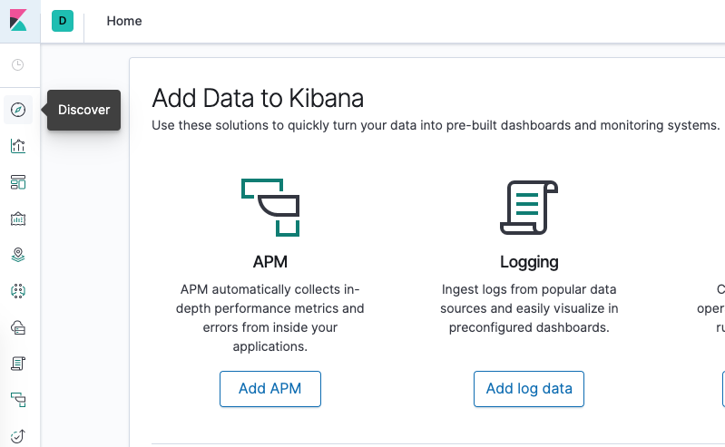

## Prerequisites

Before you begin with this guide, ensure you have the following available to you:
- A Kubernetes 1.10+ cluster with role-based access control (RBAC) enabled
- The kubectl command-line tool installed on your local machine, configured to connect to your cluster. You can read more about installing kubectl in the [official documentation](https://kubernetes.io/docs/tasks/tools/install-kubectl/). 

## Before you start
- Open the file ./k8s/elk-node/generate-public-services.sh and fill in the required values.
- After run the file ./k8s/elk-node/generate-public-services.sh to generate working k8s configurations.

### Step 1 — Creating a Namespace
Before we roll out an Elasticsearch cluster, we’ll first create a Namespace into which we’ll install all of our logging instrumentation.

Using kubectl create with the -f filename flag:

``kubectl create -f ./k8s/elk-node/ns.yaml``

### Step 2 — Creating the Elasticsearch single node
Now that we’ve created a Namespace to house our logging stack, we can begin rolling out its various components.
We’ll first begin by deploying a single-node Elasticsearch cluster.

Create the service using kubectl:

``kubectl create -f ./k8s/elk-node/elastic.yaml``

### Step 3 — Creating the Kibana Deployment and Service
To launch Kibana on Kubernetes, we’ll create a Service called kibana, and a Deployment consisting of one Pod replica.
You can scale the number of replicas depending on your production needs.

You can roll out the Service and Deployment using kubectl:

``kubectl create -f ./k8s/elk-node/kibana.yaml``

### Step 4 — Creating the Fluentd DaemonSet
In this guide, we’ll set up Fluentd as a DaemonSet, which is a Kubernetes workload type that runs a copy of a given Pod on each Node in the Kubernetes cluster.
Using this DaemonSet controller, we’ll roll out a Fluentd logging agent Pod on every node in our cluster.
To learn more about this logging architecture, consult [“Using a node logging agent”](https://kubernetes.io/docs/concepts/cluster-administration/logging/#using-a-node-logging-agent) from the official Kubernetes docs.

Now, roll out the DaemonSet using kubectl:

``kubectl create -f ./k8s/elk-node/fluentd.yaml``

### Step 5 — Creating frontend service via nginx

``kubectl create -f ./k8s/elk-node/nginx.yaml``

### Step 6 — Configure Kibana

Now, in your web browser, visit the following URL:
- http://:888/
- Login: admin
- Password: qwerty123

You can change the username and password in the file: k8s/elk-node/nginx.yaml 

We can now check Kibana to verify that log data is being properly collected and shipped to Elasticsearch.

Click on Discover in the left-hand navigation menu:

You should see the following configuration window:

This allows you to define the Elasticsearch indices you’d like to explore in Kibana.
To learn more, consult [Defining your index patterns](https://www.elastic.co/guide/en/kibana/current/tutorial-define-index.html) in the official Kibana docs.
For now, we’ll just use the logstash-* wildcard pattern to capture all the log data in our Elasticsearch cluster. Enter logstash-* in the text box and click on Next step.

You’ll then be brought to the following page:

This allows you to configure which field Kibana will use to filter log data by time. In the dropdown, select the @timestamp field, and hit Create index pattern.

Now, hit Discover in the left hand navigation menu.

You should see a histogram graph and some recent log entries:

### Step 7 — Install grafana service

``kubectl create -f ./k8s/elk-node/grafana.yaml``

### Step 8 — Login to grafana and change default password

http://:9999/
Login: admin
Password: admin 

### Step 9 — Create default datasource

Visit page http://:9999/datasources and click button "Add data source", then find elasticsearch. 

Fill the settings fields to the following:
- URL: http://elasticsearch.elk.svc.cluster.local:9200
- Index name: \[logstash-\]YYYY.MM.DD
- Pattern: Daily
- Time field name: @timestamp
- Version: 7.0+

### Step 10 — Create alert channel via Telegram

- Created a bot via @BotFather, got an API token
- Created a group chat and invited the Bot to the channel.
- Visit page http://:9999/alerting/notifications and click button "Add Channel".
- Fill the settings fields and click button "Save".

### Step 11 — Import grafana dashboard from json

- Visit page http://:9999/dashboard/import, then insert json configuration from file ./k8s/elk-node/grafana/dashboard.json to field and click button "Load".

### Step 12 - Final

